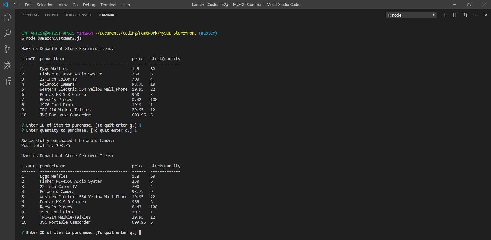
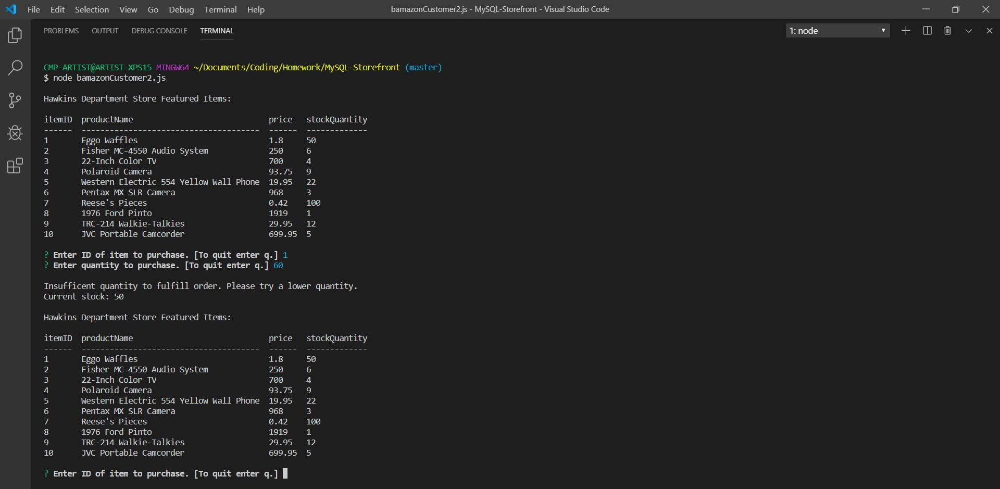
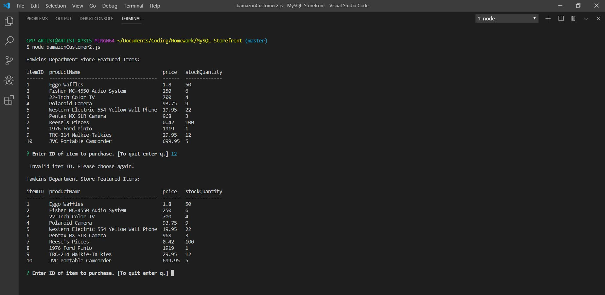
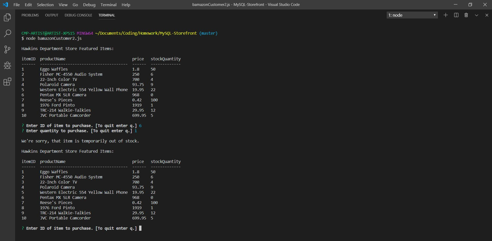
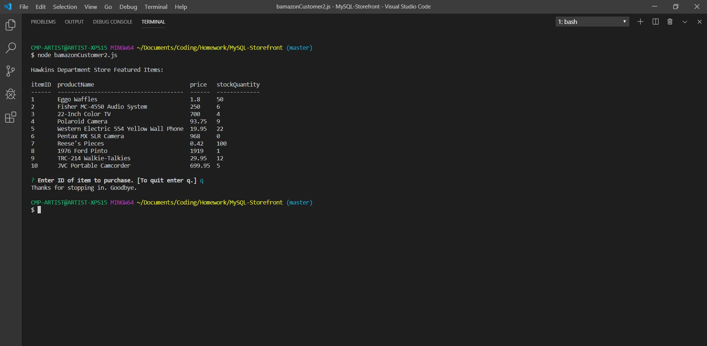

# MySQL-Storefront

A Stranger Things themed CLI Node app that takes in orders and updates inventory stored in a MySQL db. 

## Technologies

- Node.js
    - Inquirer
    - console.table
- MySQL

## Screenshots

